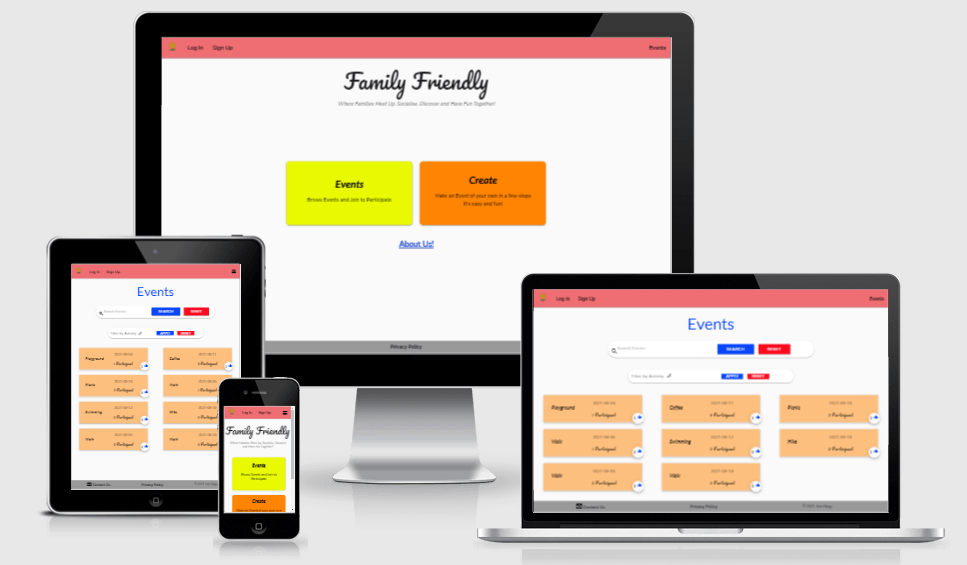
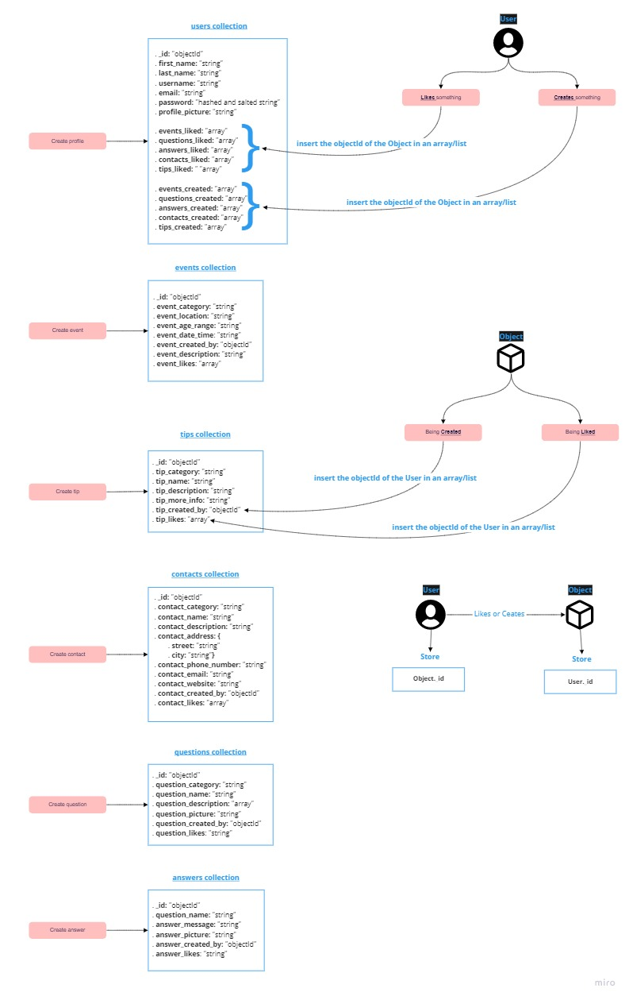
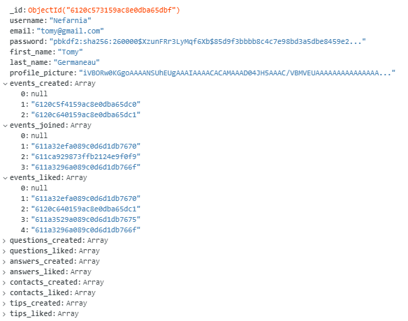
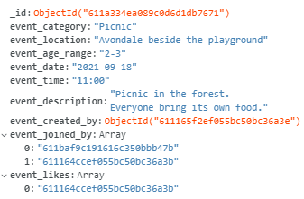

# **Family Friendly**



Visit the live Website : **[Family Friendly :arrow_right:](https://family-friendly-app.herokuapp.com/)**.

**Family Friendly** is a community based application where families can get together and have fun. This project promotes **togetherness**, **fun** and **community** through **activities**.  
It is difficult sometimes as new or experience parents to find the motivation to go out and do something with the hectic parenting life. You would have to organize something or think about going somewhere on top of preparing what you need to bring with you for your little one and for yourself. So you would consider doing nothing, stay put and deal with the craziness happening at home. A lot of different factors could amplify the sentiment.  
This can lead to inactivity, confinement and mental distress which only feed the vicious cycle.

In order to help parents and/or caretaker, I propose **Family Friendly**.  
This platform will propose features including a list of **events** coming up, the possibility to **create** and **join** event and access to **support** that provide useful *contacts* and *information*. As well a **forum** that allow users to share tips and help each other in a format of *Question* and *Answer*.

## Table of Content

* [Project](#Project)
  * [Project Goals](#Project-Goals)
  * [Developer and Business Goals](#Developer-and-Business-Goals)
  * [User Goals](#User-Goals)
* [UX](#UX)
  * [Audience Definition](#Audience-Definition)
  * [User Stories](#User-Stories)
  * [Design Choices](#Design-Choices)
  * [Wireframes](#Wireframes)
  * [Different Design](#Different-Design)
* [Features](#Features) [:fast_forward: FEATURES.md](FEATURES.md)
* [Flowchart](#Flowchart)
* [Data](#Data)
* [Code Organisation](#Code-Organisation)
* [Technologies Used](#Technologies-Used)
* [Testing](#Testing) [:fast_forward: TESTING.md](TESTING.md)
* [Deployment](#Deployment) [:fast_forward: DEPLOYMENT.md](DEPLOYMENT.md)
* [Bugs](#Bugs)
* [Credits](#Credits)
  * [Content](#Content)
  * [Acknowledgements](#Aknowledgements)

## Project

### Project Goals

This project is offering an application with a welcoming and fun environment to enable and empower users to go out, join activities and events. Encourage users to meet with the community, have fun and share good memories. It promotes healthy lifestyle and mental health.

### Developer and Business Goals

* Develop an interactive website with a server connection using HTML, CSS, JavaScript and Python.
* Provide a user-friendly application.
* Contribute to the community.
* Help parents.
* Promote Wellness and health through activities.
* Help personal and family growth.

### User Goals

* Easy to use application.
* Getting clear information.
* Quick access to Events.
* Practical way to participate and be part of the community.

[**:back:** *Table of Content*](#Table-of-Content)

## UX

### Audience definition

1. The primary targeted audience is Families and more precisely **Parents**.
2. The secondary targeted audience is **Children**.

#### The primary audience for this application is looking for:

* Getting together.
* Going out and/or outside.
* Having fun as a family.
* Sharing parental tips/advise.
* Supporting each other.
* Socialization of the children.
* Participating in a healthy community.

#### The secondary audience for this application is looking for:

* Having fun.
* Discovering.
* Meeting and Making friends.

#### This application is the best way to answer their needs because:

* Activities are created and proposed by users, for them and the community.
* It provides the possibility to Create and Join Events.
* Events are accessible in a click.
* You can identify immediately if there is a suitable Event for you and your family.
* You can Create and Join Events on the go.
* It offers parenting tips and a space where parents can browse content relevant to them.
* It is a User Centric Design approach:
  * It is a simple application to use.
  * It is very specific and get to the point.
  * The information are displayed in a fashion that is not overwhelming and easy to learn.

### User stories

#### First time users

As a first time user:

1. I want the application to be **easy to navigate** and **appealing**.
2. I want to find information in an obvious manner without having to look for it.
3. I want to **find events** and identify instantly:
    * The type of **activity**.
    * The appropriate **age** to participate.
    * The **location**.
    * The **date and time**.
4. I want to **sign up** and create a profile.
5. I want to **log in**.
6. I want to **log out**.
7. I want to be able to **join** an event.
8. I want to be provided with **easy instructions** on how to create an event.
9. I want to be able to **create** an event.
10. I want to have access to the **support** page where I can find:
    * Useful **contacts**.
    * Parenting **advices**.
    * A space where I can **share ideas** and/or **ask questions** and advices.

#### Returning users

As a returning user:

1. I want to be able to **cancel** my participation in an event.
2. I want to be able to **cancel** an event I created.
3. I want to be able to **modify** an event I created.
4. I want to be able to **modify** my profile.
5. I want to be **notified** when there is a change on an event I am participating in.
6. I want to be **notified** when people join or cancel an event I Created.
7. I want to **post** a question or advice on the support page.
8. I want to **edit or delete** a question or advice I created on the support page.
9. I want to **participate** in topic on the support page.
10. I want to **propose** a useful contact.

[**:back:** *Table of Content*](#Table-of-Content)

### Design Choices

#### Fonts

Considering the targeted audience, the sans serif type of font is the more appropriate because it is most often associated with simplicity and straightforwardness.  
I will be using:

* *Pacifico* for the name of the website (Family Friendly) only. It is a handwriting type of font which is very friendly and welcoming with its roundness and has something fun to it that relates to the website.

* *Lato* and *Nunito* are used for the rest of the website. They both are sans serif fonts, and they work very well together. They are comforting, simple and easy to ready.

*Sans serif* will be use as a fall back if the fonts do not load. It is common as the main typographies are sans serif type.

#### Icons

* Some Font Awesome icons will be part of the website for better UX.
* The [logo](app/static/images/logo/logo.png) and [favicon](app/static/images/favicon/favicon.ico) are the same image and use the color scheme of the website.


#### Colors


The colours chosen for the website are simple and joyful. They are based on the psychology behind colours ([colour affects](http://www.colour-affects.co.uk/psychological-properties-of-colours), [London Image Institute](https://londonimageinstitute.com/how-to-empower-yourself-with-color-psychology/)). I used Adobe Color to create the colour scheme.

* Yellow #E9F900 for Friendliness and Warmth.
* Blue #0845FF for Confidence, Sincerity and Integrity.
* Red #FF091E for cancelling and deleting functionality.
* Orange #FF8401 for Creativity and Innovation.
* Green #24C212 for Life, Growth and Nature.
* The background will be off White #FAFAFA for simplicity and cleanliness.
* Footer will be Grey #999999 for a nice contrast.

[Adobe Color](https://color.adobe.com/create/color-accessibility) was used to build the color compatibility and accessibility. The color scheme and swatches are said color-blind safe.


#### Images

The images will be the one uploaded by users for their profile.  
Those images are stored using base64 to encode the image and store it as a string in the user collection.

#### Styling/Feeling

The feel of the website is welcoming and simple to provide a quick access and learning process.  
It makes users comfortable and make them want to try!

#### Audio/Video

No audio or video will be integrated at the moment.

[**:back:** *Table of Content*](#Table-of-Content)

### Wireframes


* [Home page](app/static/images/README-images/wireframes/home.pdf)
* [About page](app/static/images/README-images/wireframes/about.pdf)
* [Contact page](app/static/images/README-images/wireframes/contact.pdf)
* [Events page](app/static/images/README-images/wireframes/events.pdf)
* [Create page](app/static/images/README-images/wireframes/create.pdf)
* [Sign up page](app/static/images/README-images/wireframes/signup.pdf)
* [Login page](app/static/images/README-images/wireframes/login.pdf)
* [Profile page](app/static/images/README-images/wireframes/profile.pdf)
* [404 page](app/static/images/README-images/wireframes/error.pdf)

The following is part of the future features to implement.

* [Support page](app/static/images/README-images/wireframes/support.pdf)
* [Useful contacts page](app/static/images/README-images/wireframes/useful-contacts.pdf)
* [Propose a contact page](app/static/images/README-images/wireframes/propose-contact.pdf)
* [Parenting tips page](app/static/images/README-images/wireframes/parenting-tips.pdf)
* [Propose a tip page](app/static/images/README-images/wireframes/propose-tip.pdf)
* [Forum access page](app/static/images/README-images/wireframes/forum-access.pdf)
* [Forum page](app/static/images/README-images/wireframes/forum.pdf)
* [Ask a question page](app/static/images/README-images/wireframes/ask-question.pdf)
* [Reply page](app/static/images/README-images/wireframes/reply.pdf)

For the full version:

* [Family Friendly website](app/static/images/README-images/wireframes/home.pdf)

[**:back:** *Table of Content*](#Table-of-Content)

### Different design

Thinking on how usable and intuitive the carousel is to scroll thought Events, considering that it could be a lot of them, I have decided to implement collapsible to display all the events across the website.

After considering deadline and features priority, I decided to leave the support section for future features to implement. I once heard that the project is never finished, we just run out of time!

[**:back:** *Table of Content*](#Table-of-Content)

## Features

To build this project, I use Flask framework with the Jinja templating language. For consistency across the website some features will be repeated and functionality will be kept as simple and direct as possible.

Existing and Future Features are published in a separate file, please see [FEATURES.md](FEATURES.md) for full details.

## Flowchart


[Website flowchart pdf](app/static/images/README-images/design/flowchart.pdf)

[**:back:** *Table of Content*](#Table-of-Content)

## Data

All the data schemas have been saved in JSON files in app/static/js/data-schemas

Most of the data is saved as a string and the format of the string is validated by pattern attribute in all the forms.



* For the website code production, two collections have been used in MongoDB:
  * **users**
  * **events**

* The **users** collection is organised following the user data-schema as shown below:
  * 
  * _id
    * Default field given automatically when creating a document in MongoDB. It is unique and allows to identify each document.
  * username
    * Field of string data-type that is used for users to personalized their profile. It must be unique.
    * This field is validated by checking its value against all username's field value created in the user collection. As well a pattern attribute is used on the form's input field.
  * first_name
    * Field of string data-type that is used for users to personalized their profile.
    * This field is validated with a pattern attribute on the form's input field.
  * last_name
    * Field of string data-type that is used for users to personalized their profile.
    * This field is validated with a pattern attribute on the form's input field.
  * email
    * Field of string data-type that is used for users to personalized their profile. It must be unique.
    * This field is validated by checking its value against all email's field value created in the user collection. As well a pattern attribute is used on the form's input field.
  * password
    * Field of string data-type that is used for security.
    * Before to be stored the password is hashed and salted using [werkzeug security](https://werkzeug.palletsprojects.com/en/2.0.x/utils/#module-werkzeug.security) module of Flask. It is asked to enter the password twice and a validator is used to check if the passwords correspond to the regex pattern and that they are the same.
    * When the password is used/asked on the website, it is validated by checking the password in the input field against the password saved in the database using werkzeug security tools.
  * profile_picture
    * Field of string data-type that is used for profile personalization.
    * To store the image, I have used base64 to encode the image and store it as a string. The image is first downloaded, then encoded and stored and then delete so only the string saved in the database remains.
  * events_created
    * Field of array data-type that is used in order to know which events have been created by the user in order to tailor action available on this event. This can be used in a later version of the website to send specific notifications and have information on how active is the user on the website.
  * events_joined
    * Field of array data-type that is used in order to know which events have been joined by the user in order to tailor action available on this event. This can be used in a later version of the website to send specific notifications and have information on how active is the user on the website.
  * events_liked
    * Field of array data-type that is used in order to know which events have been liked by the user in order to tailor action available on this event. This can be used in a later version of the website to send specific notifications and have information on how active is the user on the website. As well it could give information on the preferences off the user.

* The **events** collection is organised following the user data-schema as shown below:
  * 
  * _id
    * Default field given automatically when creating a document in MongoDB. It is unique and allows to identify each document.
  * event_category
    * Field of string data-type that is used for giving information on the category of the event.
    * It is validated by the select option of the form.
    * This can provide information on what type of event is preferred by users.
  * event_location
    * Field of string data-type that is used for giving information on the place at which the event will take place.
    * In future version this will be an array of coordinate using google maps in order to render a precise location.
  * event_age_range
    * Field of string data-type that is used for giving information on the age range that the event is intended for.
    * It is validated by a pattern attribute of the form's input field.
  * event_date
    * Field of string data-type that is used for giving information on the date at which the event will take place.
    * It is validated by the input type of the form.
  * event_time
    * Field of string data-type that is used for giving information on the time at which the event will take place.
    * It is validated by the input type of the form.
  * event_description
    * Field of string data-type that is used for event description.
    * This is used for users to share information about the event they have created.
  * event_created_by
    * Field of ObjectId data-type that is used in order to know who created the event in order to tailor action available on this event. This can be used in a later version of the website to send specific notifications and have information on how active is the user on the website.
  * event_joined_by
    * Field of array data-type that is used in order to know which users have joined the event in order to display the number of people attending the event. This can be used in a later version of the website to send specific notifications to users and have information on how popular is an event. As well it could give information on the type of event that users prefer.
  * event_likes
    * Field of array data-type that is used in order to know which users have liked the event in order to display the number of people that liked the event. This can be used in a later version of the website to send specific notifications to users and have information on how popular is an event. As well it could give information on the type of event that users prefer.

The data pattern is controlled by the corresponding class. This allows to have quick access to the information the documents will hold and to be able to change the data type and data structure in an efficient and effective manner.

Almost all functions/methods concerning the collection are coded in the corresponding class in order to be able to add or change those with ease and to separate the concerns.

## Code Organisation

The project uses Flask and I have implemented Application Factory and Blueprint allowing separation of concern and clearer code.

The code structure includes ``app.py`` file that initialise the App and a folder called ``app`` that host all the development code as well as the implementation of Blueprint in ``__init__.py`` and the App configuration in ``config.py``.

The use of Flask framework implies the creation of a ``static`` and ``templates`` folder. The static folder host the ``*.js``, ``*.css``, ``*.json`` files and all images.

I have Created:

* A ``classes`` folder that will host the python files related to the classes used for the project.
* A ``validators`` folder that host the validation functions for the project.
* A ``flashes`` folder that host all the flash messages.

## Technologies Used

### Programming Languages

This project uses HTML, CSS, JavaScript and Python and Jinja templating language.

### Frameworks, Libraries and Programs

* [Flask](https://flask.palletsprojects.com/en/2.0.x/)  
Flask is the micro framework on witch the project is build.

* [MongoDB](https://www.mongodb.com/)  
For hosting the database.

* [Balsamiq](https://balsamiq.com/wireframes/)  
For creating wireframes.

* [miro whiteboard](https://miro.com/)  
For producing the flowchart.

* [Google Fonts](https://fonts.google.com/)  
For importing fonts (**Fredoka One**, **Handlee** and **Andika New Basic**) into the style.css file.

* [Google Fonts Icons](https://fonts.google.com/icons?selected=Material+Icons)  
For material icons used throughout the website.

* [favicon.io](https://favicon.io/favicon-converter/)  
For generating the favicon.

* [TinyPNG](https://tinypng.com/) or [Squoosh](https://squoosh.app/)  
For resizing all the images.

* [BeFunky](https://www.befunky.com/create/)
For cropping some images.

* [Adobe Color](https://color.adobe.com/create/image)  
For extracting the color scheme used on the website.

* [Am I Responsive?](http://ami.responsivedesign.is/?url=http://ami.responsivedesign.is/#)  
For providing screenshots of the responsiveness of the website across several devices.

* [techsini](http://techsini.com/multi-mockup/index.php)  
For Multi Device Website Mockup Generator.

* [Autoprefixer CSS online](https://autoprefixer.github.io/)  
For adding prefixer in style.css for cross browser compatibility.

* [EmailJS](https://www.emailjs.com/)  
For email service implementation using API without server.

* [Git](https://git-scm.com/)  
For Version control.

* [GitPod](https://www.gitpod.io/)  
For Integrated Development Environment.

* [GitHub](https://github.com/)  
For hosting the repository.

* [Heroku](https://www.heroku.com/home)  
For deploying the website live.

[**:back:** *Table of Content*](#Table-of-Content)

## Testing

Testing information are published in a separate file for better readability.
Please see [TESTING.md](TESTING.md).

## Deployment

Deployment information are published in a separate file for better readability.
Please see [DEPLOYMENT.md](DEPLOYMENT.md).

## Bugs

:x: Issue: 
I got the following message error: ``runtimeerror-working-outside-of-request-context``.
:heavy_check_mark: Solve:  
I saved ``request.form.get`` in a var named ``form_field`` in order to help me with coding and repetition, but a ``request`` in Flask is an instance of the Request object and handle one request at the time and therefore cannot be stored in a var.

:x: Issue:  
When updating the profile info, the rendering of the info on the profile page don't update and after login out, It was not possible to log back in. I was getting the flash message ``incorrect_details``, but details were right.
:heavy_check_mark: Solve:  
The problem was because I used the User class to update the info, It hashed the password again, which I believe created a double hashed password and when checking the password validation It could not find a match.  
I changed the approach and did not convert the new info into an instance of User, but use a static method of the class taking as parameter the dictionary of the new info.

:x: Issue:  
When Updating the profile info, the updated profile info don't render on the profile template when updating the username. This must be because I rely on the username when rendering the profile page.
:heavy_check_mark: Solve:  
Update the session cookie (``session["user"]``) after updating the database and before rendering the profile template with the new ``sesion["user"]``:

```Python (line 153 in user.py)
# Update the session['user]
session["user"] = new_info["username"]
```

:x: Issue:
On iPhone when trying to see an event by clicking on the ``SEE`` button, nothing happens.  
:heavy_check_mark: Solve:  
I have added ``touchend`` event with the ``click`` event in events.js.

:x: Issue:
When signing up from my iPhone, I can create a profile and log in with the credential but the document does not appear in MongoDB. It shows that there are one too many document in the users collection. So the document was accessible from the website, existing in the database but not accessible and visible in the database.  
:heavy_check_mark: Solve:  
No able to recreate the bug, but I believe it was because the page was kept open while the user was deleted from the database.

## Credits

### Code

[Neil Lunn from stackoverflow](https://stackoverflow.com/questions/49871030/how-fetch-latest-records-using-find-one-in-pymongo)  
For sorting MongoDB query

[Fenton enable click](https://stackoverflow.com/questions/11397028/document-click-function-for-touch-device)  
For how to trigger click event on smartphone.

[GeeksforGeeks file validation](https://www.geeksforgeeks.org/validation-of-file-size-while-uploading-using-javascript-jquery/)  
For file size validation adapted to website needs.

[GeeksforGeeks 404 error with flask](https://www.geeksforgeeks.org/python-404-error-handling-in-flask/)  
For providing explanation and code on how to render the 404 page in Flask.

[Miguel Grinberg](https://blog.miguelgrinberg.com/post/handling-file-uploads-with-flask)  
For file upload explanations.

### Content

[W3schools](https://www.w3schools.com/)  

[W3docs](https://www.w3docs.com/)

[stack overflow](https://stackoverflow.com/)

[GeeksforGeeks](https://www.geeksforgeeks.org/)

[Net Lawman](https://www.netlawman.co.uk/d/website-privacy-policy)  
For privacy policy template.

### Acknowledgements

Special thanks to all Code Institute's team (“Teacher”, Lecturers and Tutors) that are making me more knowledgeable and are making this happen.

Huge thank you to the [Slack](code-institute-room.slack.com) community, all the members and all the leads and tutors for their help and support.

I am hugely grateful to my mentor Chris Quinn for guiding me through this project.

[**:back:** *Table of Content*](#Table-of-Content)
