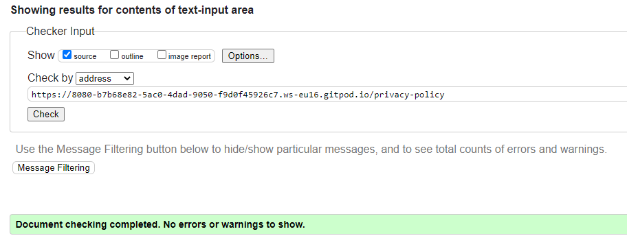
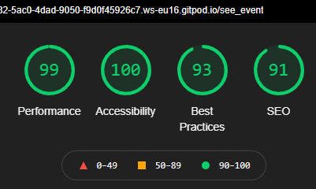
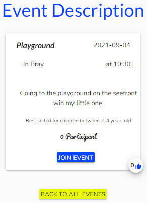

# TESTING

**[:leftwards_arrow_with_hook: *README.md*](README.md)**

Visit the live Website : **[Family Friendly :arrow_right:](https://family-friendly-app.herokuapp.com/)**.

## Table of Content

* [Code Validation](#Code-Validation)
  * [W3C](#W3C)
  * [JSHint](#JSHint)
  * [PEP8](#PEP8)
  * [Regex](#Regex)
* [Lighthouse](#Lighthouse)
* [Cross Browsers Testing](#Cross-Browsers-Testing)
  * [Manual Testing](#Manual-Testing)
  * [Conclusions and Notations](#Conclusions-and-Notations)
* [User Stories Testing from UX section of the README.md](#User-Stories-Testing-from-UX-section-of-the-README.md)
  * [First Time User](#First-Time-User)
  * [Returning User](#Returning-User)
* [Further Testing](#Further-Testing)
* [Bugs](#Bugs)

## Code Validation

All code validation has been done using text input. This allows to check HTML without getting error with the Jenja templating language used with Flask.

### W3C

W3C Markup Validation Service and W3C CSS Validation Service have been used to check all the pages of the website for semantic and syntax errors.
The results are positive, and the code is valid.

* [W3C Markup Validation Service](https://validator.w3.org/)
  * home.html
    * 
  * events.html
    * 
  * change-password.html
    * 
  * contact.html
    * 
  * create_event.html
    * 
  * delete_profile.html
    * 
  * 404.html
    * 
  * login.html
    * 
  * privacy_policy.html
    * 
  * profile.html
    * 
  * see_event.html
    * 
  * signup.html
    * 
  * update_event.html
    * 
  * update_picture.html
    * 
  * update_profile.html
    * 

* [W3C CSS Validation Service](https://jigsaw.w3.org/css-validator/)
  * 

[**:back:** *Table of Content* ](#Table-of-Content)

### JSHint

[JSHint](https://jshint.com/) was used to validate the JavaScript code for semantic and syntax errors. No warnings or error were found.  
The results are positive, and the code is valid.

### PEP8

[PEP8 online](http://pep8online.com/) was used to validate the Python code for semantic and syntax errors. No warnings or error were found.  
The results are positive, and the code is valid.

Exception:  
one line of code is too long and correspond to the regex pattern variable for password validation.

### Regex

[Regex101](https://regex101.com/) to check implementation of regex pattern.

## Lighthouse

[Lighthouse](https://developers.google.com/web/tools/lighthouse/?utm_source=devtools) is a tool provided by Google Chrome DevTools and allows to identify the site performance, accessibility and user experience on Mobile and Desktop.  
All the pages from the website have been tested with Lighthouse.

* The scores given by Lighthouse for:

  * **SEO** (Search Engine Optimization) show **Crawling and Indexing** issues with invalid robots.txt file. I have done some research but found the subject out of scope and myself in the complete dark, running out of time I decided to leave it the way it is.

  * **Accessibility** show issues regarding contrast. Those apply to some material icons that are only esthetic element and provide no information to the user. ``aria-hidden="true"`` has been added to those elements

  * **Accessibility** show issue regarding form label. This is raised by the fact that Materializecss used javascript to change the ``select`` tag to an input that does not have a corresponding label. So error is shown even though the select tag has a corresponding label. As well the date and time input have a default label and therefor through an error.

  * **Best Practice** show issues regarding image size and more precisely the favicon size expectation against the size produced on the website. Even after changing to the expected size shown by the error, the issue still exist with different sizes. This is not a major issue and I decided to leave it that way at the moment.

* home.html
  * 
  * 
* change_password.html
  * 
  * 
* contact.html
  * 
  * 
* create_event.html
  * 
  * 
* delete_profile.html
  * 
  * 
* error_page.html
  * 
  * 
* events.html
  * 
  * 
* login.html
  * 
  * 
* privacy_policy.html
  * 
  * 
* profile.html
  * 
  * 
* see_event.html
  * 
  * 
* signup.html
  * 
  * 
* update_event.html
  * 
  * 
* update_picture.html
  * 
  * 
* update_profile.html
  * 
  * 

[**:back:** *Table of Content* ](#Table-of-Content)

## Cross Browsers Testing

The website was tested on several browsers (Google Chrome, Mozilla Firefox, Microsoft Edge, Safari and Opera) and shows good functionality across them all.  

### Manual Testing

Manual testing was executed on **all browsers** as shown in the following section.

The responsiveness of the website for different viewport sizes was tested by dragging the window up, down, left and right.  
The following tests have been executed several times at different viewport breakpoints.

* Buttons on hover :heavy_check_mark:
* Buttons on focus :heavy_check_mark:
* Buttons on active :heavy_check_mark:
* Clicking Buttons and expecting behavior happens :heavy_check_mark:
* Link on hover :heavy_check_mark:
* Link on focus :heavy_check_mark:
* Link on active :heavy_check_mark:
* Clicking Link and expecting behavior happens :heavy_check_mark:
* Validation of inputs :heavy_check_mark:
* Submitting Forms :heavy_check_mark:
* Modal Triggers :heavy_check_mark:
* Like and unlike event :heavy_check_mark:
* Create/Update(Edit)/Delete events :heavy_check_mark:
* Join/Leave events :heavy_check_mark:
* Create/Update(Edit)/Delete profile :heavy_check_mark:
* Change Password :heavy_check_mark:
* Image upload size when updating image profile :heavy_check_mark:
* Login and Log out :heavy_check_mark:
* Contact :heavy_check_mark:
* Search event with input :heavy_check_mark:
* Search event with select :heavy_check_mark:

### Conclusions and Notations

All the features and functionality works very well across browser except for some features on safary and iOS.

Noted issues on iPhones and iOS:

* The display of the date and time picker is not rendering. The input is working when clicking on it, but the labels don't show. Instead, we see and input line.

Noted general issue:

* The select form element from materialize is not very easy to adjust in the front end and could cause a negative effect on the UX.
* Because of bad time and date picker behavior with materialize library, I have opted for the default browser one which works but is not the best UI.
* It is possible to search events by date, but It would be a great addition to add some validation on the date of the event in order to delete it if the date is passed.
* On the same last note, the events appear in order of creation and not by the closest from "today".

All those points are not major bugs to fix and will be implemented in the near future with the support section of the website.

[**:back:** *Table of Content* ](#Table-of-Content)

## User Stories Testing from UX section of the README.md

### First time users

As a first time user:

1. I want the application to be **easy to navigate** and **appealing**. :thumbsup:
    * The website is straight forward with little manipulation to reach the main sections of it. As well, it uses the Materialize library that is UX focus and provide great UI.

2. I want to find information in an obvious manner without having to look for it. :thumbsup:
    * The website is very specific and therefor very clear to navigate through its content.

3. I want to **find events** and identify instantly:
    1. The type of **activity**. :thumbsup:
    2. The appropriate **age** to participate. :thumbsup:
    3. The **location**. :thumbsup:
    4. The **date and time**. :thumbsup:
    * Events are presented in collapsible that show The activity, date, number of participant and like as first information. When clicking on the event, it shows the location, the time, the description and the age range.

    * 

4. I want to **sign up** and create a profile. :thumbsup:
    * A sign up link is always presented in the navigation bar if the user is not logged in.
    * When signing up, the user is directed to his profile page where he can change his information and add a picture.

5. I want to **log in**.
    * A log in link is always presented in the navigation bar if the user is not logged in.
    * 

6. I want to **log out**.
    * A log out link is always presented in the navigation bar if the user is logged in.
    * 

7. I want to be able to **join** an event.
    * When browsing events, the user has the possibility to click on ``see`` in order to see the event. This offer then the possibility to join an event.
    * 

8. I want to be provided with **easy instructions** on how to create an event.
    * The forms are very easy to fill up and straight forward with helper text when needed.
    * 

9. I want to be able to **create** an event.
    * The User once logged in or sign up has the option of creating an event.
    * 

10. I want to have access to the **support** page where I can find:
    1. Useful **contacts**.
    2. Parenting **advices**.
    3. A space where I can **share ideas** and/or **ask questions** and advices.

    * The support section of the website will be launched in the next release in the near future.

### Returning users

As a returning user:

1. I want to be able to **cancel** my participation in an event.
    * When joined, and event can be left with the ``leave`` button.
    * 

2. I want to be able to **cancel** an event I created.
    * When created, An event can be canceled.
    * 

3. I want to be able to **modify** an event I created.
    * As well as leaving and event, the option of updating the event is given via the ``Update`` button.

4. I want to be able to **modify** my profile.
    * When a profile is Created, the user can Update his profile and delete his profile.

All the following user story will be answered in the next release of the website in the near future.

5. I want to be **notified** when there is a change on an event I am participating in.
6. I want to be **notified** when people join or cancel an event I Created.
7. I want to **post** a question or advice on the support page.
8. I want to **edit or delete** a question or advice I created on the support page.
9. I want to **participate** in topic on the support page.
10. I want to **propose** a useful contact.

[**:back:** *Table of Content* ](#Table-of-Content)

## Further Testing

* The website has been tested by fellow students, slack community, friends and family.
* All the issues raised have been addressed.

* An issue has appeared on the console when loading the page:

[**:back:** *Table of Content* ](#Table-of-Content)